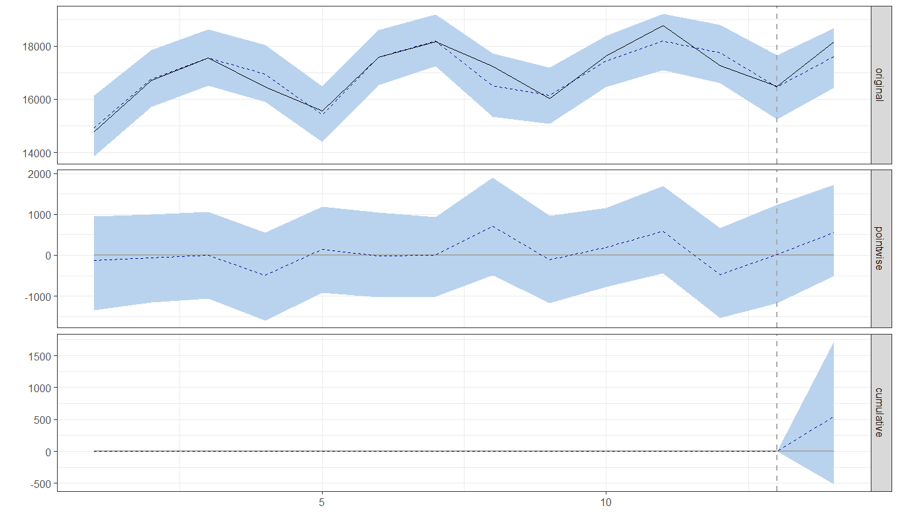

# [인과추론 연습문제] GS25 매출 변화에 대한 인과적 분석

<인과추론 서머세션>에서 강의 자료로 준비한 사례로서, 현실에서 일어나고 있는 인과추론 문제를 살펴봄으로써 인과적 사고와 데이터 분석의 중요성에 대해 조명해보고자 합니다. 특히, 본 포스팅에서는 최근에 언론과 온라인 커뮤니티에서 회자되고 있는 GS25 를 둘러싼 남혐 논란과 2021년 2분기에 GS25 의 매출 감소 현상에 대한 인과적인 분석을 수행해보고자 합니다. 가급적 해당 기업에 관한 시사/경영 이슈에 대한 가치 판단은 모두 배제하고 데이터 분석 결과만 논의할 예정이며, 분석에 활용된 데이터와 R 코드는 모두 공유되어 있으니 자유롭게 테스트 해보시길 바랍니다. 매우 긴 포스팅임을 미리 참고해주세요.
#### 본문을 읽기 전에 아래 질문에 대해서 먼저 생각해 보시길 추천 드립니다.
1. GS25 를 둘러싼 이슈는 인과추론 문제인가?
2. 인과적인 효과를 어떻게 정의하고 측정할 수 있을까?
3. GS25 와 CU 를 비교하는 건 합당할까? 만약 아니라면, 대안은 무엇인가?
4. 분석 결과를 어떻게 신뢰할 수 있을까?  

## 1.	GS25 를 둘러싼 이슈는 인과추론 문제인가?
-	여기서 인과추론은 원인과 결과를 분석하는 모든 데이터 분석으로 정의하겠습니다. 인과추론 문제는 데이터의 특성이나 분석 방법론에 의해 결정되지 않습니다. 예를 들어, 대표적인 데이터 분석 방법론 중 하나인 회귀분석(regression)은 인과추론에도 활용될 수 있고 예측모델로 활용될 수도 있습니다.
-	인과추론 문제는 분석의 목적에 따라 결정될 수 있습니다. 원인에 대한 개입과 조정을 통해 결과를 개선하고자 하는 것이 목적이라면 인과추론(causal inference) 문제라고 볼 수 있고, (목표치에 가까운) 최선의 결과를 도출하는 것이 목적이라면 예측(prediction) 문제라고 볼 수 있습니다. 더 나아가, 한정된 자원(예산) 하에서 원인에 대한 개입 전략이나 예측 전략을 최적화하는 의사결정은 처방(prescription) 문제로 정의할 수 있습니다.
-	GS25 이슈의 주요 목적이 무엇일까요? 물론 사람들에 따라 다르겠지만, 대중들 입장에서는 “온라인에서 일어난 논란과 움직임”에 대한 인과적 효과를 이해함으로써 그러한 움직임의 확대 또는 저지의 필요성을 주장하기 위해, 기업 입장에서는 그러한 온라인에서의 논란이 기업 성과에 미치는 영향을 최소화하기 위한 대응 전략을 고안하기 위해, 이러한 문제에 주목하게 될 것입니다. 즉, 원인에 대한 개입과 조정이 주된 목적이라는 측면에서 GS25 를 둘러싼 이슈는 인과추론 문제로 볼 수 있습니다. 

## 2.	인과적인 효과를 어떻게 정의하고 측정할 수 있을까?
-	일상 생활에서 인과관계에 대해서 누구나 쉽게 떠올릴 수 있지만 그걸 정량적으로 측정하는 건 또 다른 문제입니다. 가장 널리 활용되는 프레임워크 중 하나인 잠재적 결과 프레임워크(potential outcomes framework) 하에서는 인과적 효과를 원인이 있었을 때의 결과(사실; factual)와 그 원인이 없었다면 있었을 잠재적 결과(반사실; counterfactual) 간의 차이로 정의하고 있습니다.
-	하지만, 인과추론의 근본적인 문제는 잠재적 결과인 반사실을 현실에서 관찰할 수 없다는 것입니다. 그래서 인과추론 분석의 가장 핵심은 특정 원인을 제외하고 나머지 사실에서 모두 비교 가능해서 (실제 관찰할 수 없는) 반사실에 근접한 통제집단을 구성하는 것입니다.

## 3.	인과추론 분석 방법론 – 준실험/이중차분법
-	(실제로 어떤 원인이 있었지만) 만약 그 원인이 없었다면 있었을 처치집단의 반사실과 유사한 통제집단을 어떻게 구성할 수 있을까요? 가장 유용한 방법은 바로 무작위 실험(randomized experiment)을 수행함으로써 비교가능한 통제집단을 인위적으로 구성하는 것입니다. 하지만 현실의 많은 문제에서 이러한 실험이 불가능하다는 건 자명한 사실입니다. 그래서 무작위로 처치집단과 통제집단을 나누지는 않지만, 연구 디자인을 활용해서 합리적인 통제집단을 구분해서 분석할 수 있는데 이를 준실험(quasi-experiment)이라고 부릅니다.
-	현실에서 관찰할 수 없는 반사실을 유추하기 위한 인과추론 방법론은 언제나 가정을 수반합니다. 세부 방법론에 따라 디테일은 다르지만, 결국 가장 중요한 핵심 가정은 실제 원인이 없던 통제집단에서의 변화가 (실제 원인이 있었지만) 만약 원인이 없었다면 있었을 처치집단에서의 변화가 유사하고 비교가능하다는 것입니다.
-	이러한 준실험을 분석하는 대표적인 도구 중 하나가 이중차분법(difference-in-differences)입니다. 인과추론을 위해서는 실제 원인이 있었을 때의 결과와 원인이 없었다면 있었을 잠재적 결과 간에는 원인이 있었다는 사실을 제외하고는 모두 유사해야 한다는 걸 다시 상기해봅시다. 이러한 차이를 (1) 시간에 따라 변하지 않는 차이(예: GS25 의 고유한 특성)와 (2) 원인이 아닌 다른 요인에 의해서 시간에 따라 변하는 차이(예: 신규/폐점 점포, 소비환경 변화)로 나눌 수 있는데, 이를 최소화하는 것이 이중차분법의 목적입니다. 여기서, (i) 시간에 따라 변하지 않는 차이는 처치집단에서 원인이 있은 전/후의 차이를 통해서 효과적으로 배제하고, (ii) 원인이 없었더라도 시간에 따라 변하는 잠재적 결과의 변화는 (실제 원인은 없었지만 처치집단과 비교가능한) 통제집단에서의 변화를 통해 간접적으로 유추할 수 있을 것입니다. 이를 종합해보면, 처치집단에서 원인이 있은 전/후의 차이에서 통제집단에서 전/후의 차이를 한 번 더 차분함으로써 “이중”차분법을 구성할 수 있게 됩니다. 이러한 이중차분법의 핵심 가정은 원인이 있기 전까지는 처치집단과 통제집단의 시간에 따른 변화가 유사해야 한다는 것인데, 이를 평행 추세 가정(parallel trends assumption) 이라고 부릅니다.

## 4.	통제집단 없는 인과추론 – 시계열 분석
-	물론 통제집단 없이도 원인이 있었던 이후 기간에서의 잠재적 결과(반사실)를 효과적으로 추정할 수 있다면 충분히 인과추론이 가능할 것입니다. 대표적인 사례가 바로 시계열 분석을 활용하는 방법입니다. 간단히 설명하자면, 원인이 있기 이전 기간의 데이터를 바탕으로 시계열 예측 모델을 만들고, 원인이 있었던 이후 기간으로 예측을 연장하여 반사실을 추론하고자 하는 접근입니다. 그림 1. 은 R 의 CausalImpact 패키지(https://cran.r-project.org/web/packages/CausalImpact/vignettes/CausalImpact.html)를 활용해서 분석한 결과를 보여주고 있습니다.[1](#myfootnote1) 분석 결과, 2021년 2분기에서 시계열 예측을 통한 잠재적 결과 보다 매출이 조금 높은 걸 알 수 있는데 통계적으로 유의하지는 않습니다.
-	하지만, 통제집단 없이 수행하는 인과추론은 많은 한계를 지닐 수 밖에 없는데, 처치집단의 과거 데이터만 가지고 미래에 있을 반사실을 정확하게 예측하는 건 쉽지 않기 때문입니다. 시계열 분석은 정규화된 변화(예: 계절 효과, 추세, 자기상관) 등은 효과적으로 설명할 수 있지만, 원인 이외의 외부 환경 변화(예: 코로나19) 등에 대해서는 다른 비교대상을 통해 간접적으로 유추할 수 있는 방법이 없기 때문에 이를 예측에 반영하는 건 한계가 있을 수 밖에 없습니다. 또한, 많은 기업들은 과거의 정보 뿐 아니라, 미래에 대한 전망을 종합적으로 고려하여 내생적으로 의사결정을 하기 때문에 과거 데이터를 활용해서 예측한 미래의 잠재적 결과가 특정 원인과 무관하다는 걸 증명하는 것도 쉽지만은 않을 것입니다.

## 5.	통제집단의 구성 (1) GS25 vs CU
-	공정거래위원회 가맹사업거래(https://franchise.ftc.go.kr/)에 따르면, 2020년 기준 GS25 의 가맹점 수는 13,818개로 업계 1위이고, 그 뒤를 바짝 따르는 것이 CU 이며 가맹점 수는 13,737개로 매우 유사합니다. 따라서, GS25 와 비교가능한 통제집단으로서 CU 를 고려하는 건 지극히 합리적인 전략입니다. 그럼 결국 인과추론을 위해 던져야 할 가장 중요한 질문은, (실제 온라인 상에서의 논란이 있었지만) 만약 논란이 없었다면 있었을 GS25 의 매출 추이와 같은 시기에 논란이 없었던 CU 의 매출 추이가 얼마나 유사한지 여부일 것입니다.
-	그림 2. 은 2018년~2020년 기간의 GS25 와 CU 의 매출액/영업이익률의 추이를 보여주고 있습니다. 이 두 기업들의 추이가 어느정도 유사하다고 생각하시나요? GS25 와 CU 성과의 추이는 어느정도 유사하지만, 완전히 동일해 보이지는 않습니다.

## 6.	통제집단의 구성 (2) GS25 vs 가상의 통제집단 (Synthetic Control)
-	CU 가 합리적인 통제집단이 될 수 있지만, 좀 더 나은 통제집단을 구성해볼 순 없을까요? 이때 고려해볼 수 있는 방법론이 바로 가상의 통제집단(Synthetic Control) 방법론입니다. 아이디어는 간단한데, 원인이 없는 시기에 여러 통제집단들의 조합으로 처치집단에서의 추세를 모방하는 가상의 통제집단을 구성하고, 이를 통해서 원인이 있었던 시기에서의 반사실을 추정하고자 하는 접근입니다. 본 분석에서는 GS25 (GS리테일 내 편의점 부문)의 가상의 통제집단을 구성하기 위해서, (1) 편의점 트렌드를 반영하기 위해 가맹점 수의 91.2%를 차지하는 업계 Top 4 중 GS25 를 제외한 CU (BGF리테일), 세븐일레븐 (롯데지주 내 코리아세븐), 이마트24 (이마트 내 이마트24 부문), (2) GS리테일 그룹의 전사적인 변화를 반영하기 위해 GS리테일 내의 GS슈퍼, (3) 유통업계 트렌드를 반영하기 위해 대형마트인 이마트/롯데마트와 슈퍼마켓인 에브리데이/롯데슈퍼를 활용해서 2018년~2020년까지의 분기별 매출액/영업이익률 데이터를 활용해서 가상의 통제집단을 구성했습니다. 모든 데이터는 각 기업들의 공시자료를 활용했고, 분석에는 R 의 TidySynth 패키지(https://github.com/edunford/tidysynth)를 활용했습니다. 
-	그림 3. 에서 볼 수 있는 것처럼, CU 85.3%와 이마트 14.7%의 조합으로 GS25 의 매출 추이를 모방하는 가상의 통제집단을 구성할 수 있었습니다. 이는 GS25 와 가장 유사한 CU 뿐 아니라, 유통업계 전반의 트렌드를 반영할 수 있는 이마트의 실적을 동시에 고려함으로써 GS25 의 실적을 모방할 수 있다고 해석해볼 수 있을 것입니다. 그럼 3. 는 GS25 와 가상의 통제집단의 매출액의 추이를 보여주고 있습니다. 가상의 통제집단은 단순히 CU 와 단독 비교하는 것 보다 GS25 의 매출 추이를 훨씬 더 근접하게 추종하고 있는 걸 알 수 있습니다.
-	가상의 통제집단을 통한 분석 결과, 2021년 2분기에 GS25 의 실적이 좋지 않았던 것은 분명해 보입니다. 왜냐하면, 잠재적으로 GS25 가 얻을 수 있었던 매출과 비교했을 때 약 440억원의 매출(전체 매출의 2.4%)이 줄었기 때문입니다. 혹자는 이 결과를 활용하여 이중차분법을 적용해서 2021년 2분기에 GS25 의 매출이 줄어드는 인과적인 효과가 있었다고 결론 내릴지도 모릅니다. 하지만, 이러한 비교를 통해서 2021년 2분기에 있었던 “남혐 논란”이 원인이라고 주장할 수 있을까요?

## 7.	모델 가정 검증 및 강건성 분석의 중요성
-	모든 통계 모델링은 모델에 대한 가정이 필요한데, 이는 연구자의 재량이기 때문에 최악의 경우 연구자의 입맛에 맞는 결과만 취사선택할 가능성도 배제할 수 없습니다. 그래서 우리는 모든 데이터 분석에서 인과추론 방법론의 가정을 엄밀히 따져봐야 합니다. 모든 데이터 분석은 적절한 가정을 수반한다는 사실을 이해하는 것은 분석 결과를 비판적으로 받아들이는 첫걸음입니다.
-	앞서 살펴본 이중차분법의 핵심 가정을 떠올려봅시다. 이중차분법에서는 “원인이 있기 전까지는” 처치집단(GS25)와 통제집단의 추세가 평행해야만 원인이 있은 이후의 결과의 차이를 인과관계로 해석할 수 있다고 말하고 있습니다. 하지만, 그림 4. 에서 나타나는 것처럼, GS25 의 매출이 잠재적 결과보다 낮아지기 시작한 건 작년 3분기부터였고 2021년 1분기에는 잠재적 성과 대비 더 큰 폭의 매출 감소(약 740억원)가 있었습니다. 이러한 점을 고려했을 때, 2021년 2분기를 기점으로 이중차분법을 적용하는 건 원인이 있기 이전 시점에서 추세가 평행해야 한다는 가정에 위배되는 걸 알 수 있습니다. 
-	또 다른 관점에서 해석해보자면, 관찰되는 변화가 정말 해당 시기에 발생한 특정 원인 때문인지 테스트하기 위해서, (1) 해당 시기에 (원인에 영향을 받지 않았던) 다른 기업에도 이러한 변화가 나타나는지, (2) 임의의 다른 시점을 가상의 원인(placebo)으로 보면 아무런 변화가 관찰되지 않는지를 테스트할 수 있습니다. 다른 기업에 대한 분석은 바로 뒤이어 설명하기로 하고, 2021년 2분기 이전 시기를 기준으로 가상의 통제집단을 구성하고 이중차분법을 적용해본다면, 2020년 1~4 분기 또는 2021년 1분기를 기준으로 적용해도 거의 동일한 효과가 발견됩니다. 따라서, 2021년 2분기에 GS25 의 매출이 유의하게 감소했던 것은 사실이지만, 이러한 매출 감소는 2021년 2분기에 있었던 특정 원인에 기인한다기 보다는 작년 말부터 시작된 트렌드로 보는 편이 더 적절하지 않을까 생각합니다.
-	이처럼 모델의 신뢰도를 높이는 일련의 분석을 강건성 분석(robustness check) 또는 민감도 분석(sensitivity test)이라고 부릅니다. 모델이나 데이터에서의 작은 변화에도 분석 결과가 민감하지 않고 일관되게 유지된다는 걸 보이는 것인데, 이러한 강건성 분석과 민감도 분석은 모든 통계분석에서 대단히 중요하다고 할 수 있습니다.

## 8.	편의점 업계 동향에 대한 추가 분석
-	이번에는 매출이 아닌 영업이익률(매출 대비 비용을 제외한 영업이익 비율)에 대한 가상의 통제집단을 구성해보겠습니다. 그림 5. 에서 볼수 있는 것처럼, 매출 추이와는 달리 2020년 이후 GS25 의 영업이익률은 오히려 잠재적 성과 대비 더 높은 걸 볼 수 있습니다.
-	추가적인 해석을 위해서 경쟁 업체들에 대해서도 분석해보겠습니다. 그림 6. 과 그림 7. 은 편의점 업계 2, 3위 기업인 CU 와 세븐일레븐의 매출과 영업이익률에 대한 가상의 통제집단과 실제 값을 보여주고 있습니다. 분석 결과, CU 는 잠재적 결과 대비 매출이 크게 높아진 걸 알 수 있고, 이는 2020년 2분기부터 시작된 변화라는 걸 알 수 있습니다 (참고로, CU 의 히트상품인 “곰표”는 2020년 5월에 출시되었습니다). 그리고 CU 는 2021년 2분기에 그들이 올릴 수 있었던 잠재적 성과 대비해서 매우 좋은 성과를 냈는데, 잠재적 매출 대비 약 1080억원의 매출(전체 매출의 약 6.4%) 증가가 있었습니다. 반면에, 영업이익률은 크게 변화하지 않았고 잠재적 성과 대비 오히려 조금 낮다는 것도 확인할 수 있습니다. 
-	그림 7. 은 현재 편의점 업계에서 가장 위기에 처한 것은 GS25 가 아니라, 세븐일레븐 일지도 모른다는 걸 보여주고 있습니다. 세븐일레븐은 코로나가 시작된 작년부터 매출과 영업이익률 모두 잠재적 결과 대비 큰 폭으로 감소한 걸 볼 수 있습니다.
-	우리는 이러한 결과들을 어떻게 종합적으로 해석할 수 있을까요? 잠정적인 제 결론은 이렇습니다. 코로나로 타격을 받은 2020년 이후로 GS25 는 매출 신장에 어려움을 겪고 있고, CU 는 이를 전화위복의 기회로 활용해서 매출을 크게 끌어올리고 있는 것으로 보입니다. 하지만, 기업 입장에서 중요한 건 매출이 아니라, 비용을 제외한 영업이익과 순이익입니다. 이러한 관점에서 GS25 는 매출이 감소하고 있지만 영업이익률은 오히려 증가하고 있는 걸 볼 수 있는데, 이는 GS25 가 공격적인 투자 보다는 비용 절감에 초점을 둔 경영전략을 펼치고 있기 때문으로 해석할 수 있습니다. 반면에, CU 는 공격적인 투자를 통해 매출 증대에 초점을 두고있고, 이로 인한 비용 증가로 인해 영업 이익률은 큰 변화가 없거나 오히려 감소하고 있는 걸 볼 수 있습니다. 즉, 편의점 업계의 앙대산맥인 GS25 와 CU 의 경쟁 양상이 달라지고 있다고도 볼 수 있는데(GS25 의 비용절감 전략 vs. CU 의 공격적 투자 전략), 주목할 점은 이러한 변화는 코로나가 시작되기 전부터 시작되었다는 점입니다. 2019년의 해당 기사는 이러한 변화의 시작을 잘 보여주고 있습니다 (http://news.bizwatch.co.kr/article/consumer/2019/05/14/0014). 이러한 편의점 업계 Big 2 의 선전 속에서 3등 기업인 세븐일레븐은 총제적인 어려움을 겪고 있는 것으로 보입니다.

## 9.	메커니즘 분석의 중요성과 이를 위한 필요 조건
-	하지만, 위에서의 분석은 데이터 상의 한계가 많기 때문에 단정적으로 결론을 내리는 것은 지양해야 합니다. 왜냐하면, 현재 데이터 분석을 통해서 우리가 실제 분석하고 있는 원인은 “2021년 2분기”에 (다른 업체들에 공통으로 적용되는 요인을 제외한) GS25 에만 발생한 일련의 사건들이지, 그 때 발생했던 특정 사건의 효과만 떼어놓고 분석하는 것은 아니기 때문입니다. 예를 들어, GS25 가 보도자료를 통해 말하고 있는 것처럼 “5~6월 강수 여파” 효과도 완전히 배제할 수는 없을 것입니다. 이처럼 인과적 효과를 추정하는 것 뿐 아니라, 이를 야기하는 메커니즘을 밝히는 것도 매우 중요한 인과추론 분석입니다.
-	이러한 메커니즘 분석을 위해서는 보다 세밀한 데이터가 요구됩니다. 예를 들어, “온라인 상에서의 남혐 논란”에 대한 원인을 분석하기 위해서, 네이버 데이터랩에서 구할 수 있는 지역별/성별/연령별/업종별 검색어 트렌드나 카드사용 내역 데이터 등을 활용해서 특정 인구 집단(cohort)이 많은 지역에서 GS25 의 매출의 변화가 더 컸는지, 또는 특정 인구집단이 선호하는 상품군의 매출의 변화가 더 컸는지에 대해 분석할 수 있을 것입니다. 비슷하게, “5~6월 강수 여파”에 대한 원인을 분석하기 위해서, 지역별 강수량 데이터를 활용해서 강수량이 더 많았던 지역에서 GS25 의 매출이 더 크게 변화했는지를 분석할 수 있을 것입니다.
-	이러한 관점에서 빅데이터의 진정한 힘은 데이터 사이즈가 아닌, 보다 엄밀한 인과추론을 위한 데이터의 세밀도(granularity)에서 나온다고 볼 수 있을 것입니다.

## 10.	결론
-	인과추론은 올바른 의사결정을 위해서 중요합니다. 하지만, 데이터는 정직하지만 투명하지는 않습니다. 모든 상관관계가 함께 버무려져 있는 데이터만으로 특정 요인의 인과적인 효과를 추론하는 건 현실 문제에서는 거의 불가능에 가깝기 때문에, 모든 데이터 분석은 가정을 필요로 하고 그렇기 때문에 필연적으로 불완전합니다. 하지만, 논리적인 연구 디자인과 모델에 대한 엄밀한 가정 검증을 통해 충분히 합리적인 인과추론을 도모할 수 있을 것입니다. 
-	인과 관계를 보다 합리적으로 추론하기 위해서는 잠재적 결과 프레임워크나 구조적 인과모형과 같은 다양한 인과추론 프레임워크를 이해하는 것이 중요합니다. 인과추론 서머세션(https://sites.google.com/view/causal-inference2021)은 그러한 목적에서 기획되었으며, 총 18개의 세미나 영상들은 곧 순차적으로 유튜브(https://www.youtube.com/channel/UCkEHnPq2T8Vpafk3p-Rk49A)에 업로드 될 예정입니다.
-	모든 데이터 분석은 필연적으로 불완전합니다. 하지만, 논리적인 연구 디자인과 모델에 대한 엄밀한 가정 검증을 통해 충분히 합리적인 인과추론을 도모할 수 있을 것입니다. 
-	데이터 분석에 대한 피드백과 챌린지는 언제나 환영합니다. 가급적 댓글 보다는 이메일로 의견 보내주세요 (jiyong.park@uncg.edu).  

<a name="myfootnote1">1</a>: 모델에 관한 자세한 설명은 Brodersen, K.H., Gallusser, F., Koehler, J., Remy, N. and Scott, S.L., 2015. Inferring causal impact using Bayesian structural time-series models. Annals of Applied Statistics, 9(1), pp.247-274. 참고.
